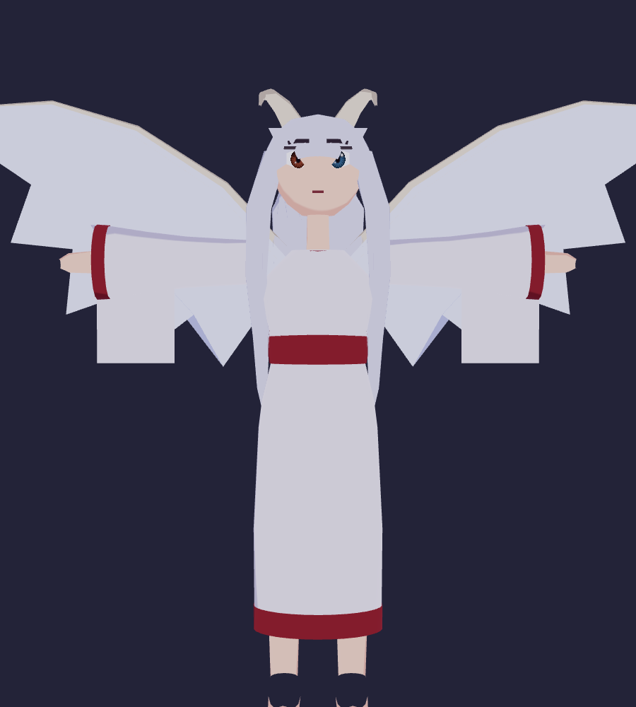

# Dragona Cósmica — Avatar VRM para VSeeFace

Avatar 3D **generado 100% por código** (Python puro, sin Blender ni Unity),
compatible con **VSeeFace** y cualquier aplicación que soporte VRM 0.x
(VTube Studio con plugin, VNyan, Warudo, VRChat con conversión, etc.).



Basado en la referencia del personaje: dragona estilo anime con pelo largo
plateado, **heterocromía** (ojo derecho rojo / ojo izquierdo azul), cuernos
de dragón, grandes alas blancas, cola de dragón y kimono blanco con obi rojo.

## Cómo usarlo en VSeeFace

1. Descargá [VSeeFace](https://www.vseeface.icu/) y descomprimilo.
2. Copiá `DragonaAvatar.vrm` a la carpeta que quieras.
3. Abrí VSeeFace → **Add avatar** → seleccioná `DragonaAvatar.vrm`.
4. Elegí cámara y micrófono → **Start**.

El avatar ya trae todo lo que VSeeFace necesita:

| Función | Cómo está implementada |
|---|---|
| Lip-sync (micrófono/cámara) | Blendshapes `A, I, U, E, O` |
| Parpadeo automático y por tracking | `Blink, Blink_L, Blink_R` |
| Expresiones (hotkeys en VSeeFace) | `Joy, Angry, Sorrow, Fun, Neutral` |
| Seguimiento de mirada | Huesos `leftEye`/`rightEye` (lookAt por hueso) |
| Física de pelo, cola y alas | Spring bones (secondaryAnimation) con colisores |
| Esqueleto humanoide completo | 19 huesos humanoid + 21 auxiliares |

## Regenerar / personalizar el modelo

Requisitos: Python 3 con `numpy` y `pillow`:

```bash
pip install numpy pillow
python3 generate_vrm.py     # genera DragonaAvatar.vrm
```

Todo es editable en `generate_vrm.py`:

- **Colores**: constantes `COL_*` al inicio (piel, pelo, kimono, obi, alas…).
- **Ojos**: `make_iris_png(...)` en `build()` — cambiá los colores de la
  heterocromía.
- **Proporciones**: posiciones de huesos en la sección `BONES` y perfiles de
  los `lathe(...)` (cabeza, torso, falda).
- **Física**: rigidez/gravedad de pelo, cola y alas en `bone_groups`.
- **Expresiones**: deformaciones en `face_morph_delta(...)`.

## Verificación visual (opcional)

Con Node y Chromium instalados podés renderizar el modelo sin abrir VSeeFace:

```bash
npm install                  # three.js + @pixiv/three-vrm (visor local)
pip install playwright
python3 shot.py front,face   # capturas en shot_*.png
python3 shot.py face happy:1 # probar una expresión
```

## Archivos

- `DragonaAvatar.vrm` — el avatar listo para usar (arrastrá esto a VSeeFace)
- `generate_vrm.py` — generador procedural del modelo
- `viewer.html` + `shot.py` — visor three-vrm y capturador para verificar
- `preview_*.png` — capturas de referencia
